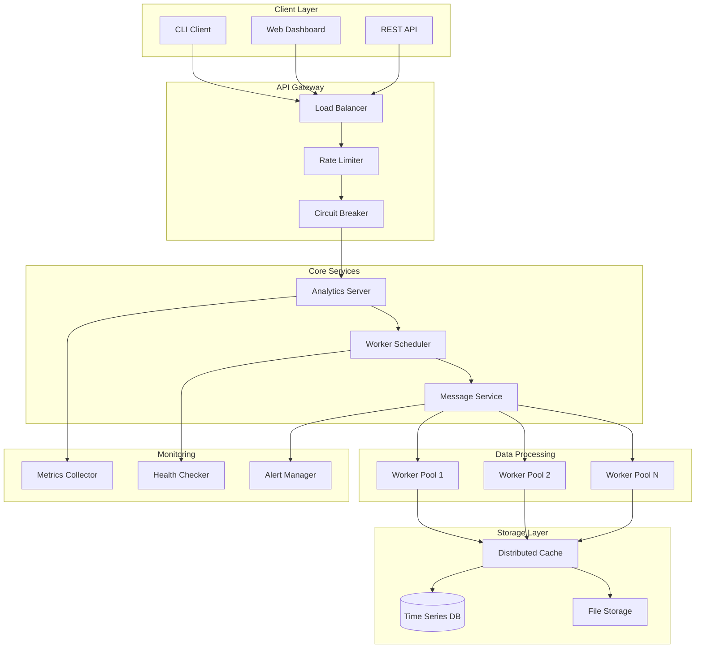

# 🚀 Distributed Real-Time Analytics Platform

[](https://golang.org/)
[](LICENSE)
[](#concurrency-patterns)

A production-grade, distributed real-time analytics platform built with Go that demonstrates advanced concurrency patterns, fault tolerance, and high-performance data processing.

## 📋 Table of Contents

- [Overview](#overview)
- [Architecture](#architecture)
- [Features](#features)
- [Concurrency Patterns](#concurrency-patterns)
- [Quick Start](#quick-start)
- [Project Structure](#project-structure)
- [Documentation](#documentation)
- [Performance](#performance)
- [Testing](#testing)
- [Deployment](#deployment)
- [Contributing](#contributing)

## 🎯 Overview

This project showcases **GOD-LEVEL** Go concurrency skills through a real-world distributed analytics platform. It processes millions of events per second, provides real-time insights, and demonstrates advanced patterns like:

- **Actor Model** for message passing
- **Reactive Programming** with backpressure
- **Circuit Breakers** for fault tolerance
- **MapReduce** for distributed processing
- **Stream Processing** for real-time analytics
- **Lock-Free Programming** for high performance

## 🏗️ Architecture



## ✨ Features

### 🚀 **High Performance**
- **1M+ events/second** processing capability
- **Sub-millisecond** latency for real-time queries
- **Horizontal scaling** to handle massive loads
- **Memory-efficient** processing with object pooling

### 🛡️ **Fault Tolerance**
- **Circuit breakers** prevent cascade failures
- **Automatic retry** with exponential backoff
- **Graceful degradation** under high load
- **Health checks** and automatic recovery

### 📊 **Real-Time Analytics**
- **Live dashboards** with WebSocket updates
- **Stream processing** for continuous analysis
- **Time-series data** storage and querying
- **Custom metrics** and alerting

### 🔧 **Advanced Concurrency**
- **Actor model** for isolated state management
- **Reactive streams** with backpressure handling
- **Lock-free data structures** for maximum performance
- **Worker pools** with dynamic scaling

## 🧵 Concurrency Patterns

This project demonstrates **11 advanced concurrency patterns**:

| Pattern | Implementation | Use Case |
|---------|---------------|----------|
| **Actor Model** | `pkg/concurrency/actor/` | Message passing between services |
| **Reactive Programming** | `pkg/concurrency/reactive/` | Stream processing with backpressure |
| **Circuit Breaker** | `pkg/concurrency/circuitbreaker/` | Fault tolerance and resilience |
| **Worker Pool** | `pkg/concurrency/workerpool/` | Parallel task processing |
| **Rate Limiting** | `pkg/concurrency/ratelimit/` | Request throttling and protection |
| **Connection Pooling** | `pkg/concurrency/pool/` | Resource management and reuse |
| **Lock-Free Programming** | `pkg/concurrency/lockfree/` | High-performance data structures |
| **Event Sourcing** | `pkg/concurrency/eventsourcing/` | Audit trail and state reconstruction |
| **CQRS** | `pkg/concurrency/cqrs/` | Command Query Responsibility Segregation |
| **Saga Pattern** | `pkg/concurrency/saga/` | Distributed transaction management |
| **MapReduce** | `pkg/concurrency/mapreduce/` | Distributed data processing |

## 🚀 Quick Start

### Prerequisites

- **Go 1.21+**
- **Docker** (for containerized services)
- **Redis** (for caching and message queuing)
- **PostgreSQL** (for persistent storage)

### Installation

```bash
# Clone the repository
git clone https://github.com/your-username/distributed-analytics-platform.git
cd distributed-analytics-platform

# Install dependencies
go mod tidy

# Start required services
docker-compose up -d

# Build the project
make build

# Run the platform
make run
```

### Basic Usage

```bash
# Start the analytics server
./bin/server --config configs/server.yaml

# Start worker nodes
./bin/worker --config configs/worker.yaml

# Send test data
./bin/client send-events --count 10000 --rate 1000

# View real-time dashboard
open http://localhost:8080/dashboard
```

## 📁 Project Structure

```
distributed-analytics-platform/
├── cmd/                          # Application entry points
│   ├── server/                   # Main analytics server
│   │   ├── main.go
│   │   └── config.go
│   ├── worker/                   # Data processing worker
│   │   ├── main.go
│   │   └── config.go
│   └── client/                   # CLI client tool
│       ├── main.go
│       └── commands/
├── internal/                     # Private application code
│   ├── server/                   # HTTP server implementation
│   │   ├── handler.go           # Request handlers
│   │   ├── middleware.go        # Middleware (auth, logging, etc.)
│   │   └── websocket.go         # WebSocket connections
│   ├── analytics/               # Analytics engine
│   │   ├── engine.go           # Core analytics logic
│   │   ├── aggregator.go       # Data aggregation
│   │   ├── calculator.go       # Metric calculations
│   │   └── stream.go           # Stream processing
│   ├── worker/                  # Worker implementation
│   │   ├── processor.go        # Data processing logic
│   │   ├── mapper.go           # MapReduce mapper
│   │   ├── reducer.go          # MapReduce reducer
│   │   └── scheduler.go        # Task scheduling
│   ├── storage/                 # Storage layer
│   │   ├── cache.go            # Distributed caching
│   │   ├── database.go         # Database operations
│   │   ├── timeseries.go       # Time series storage
│   │   └── file.go             # File storage
│   ├── messaging/               # Message passing
│   │   ├── publisher.go        # Message publishing
│   │   ├── subscriber.go       # Message subscription
│   │   ├── broker.go           # Message broker
│   │   └── queue.go            # Queue management
│   └── monitoring/              # Monitoring and observability
│       ├── metrics.go          # Metrics collection
│       ├── health.go           # Health checks
│       ├── tracing.go          # Distributed tracing
│       └── alerting.go         # Alert management
├── pkg/                         # Public library code
│   ├── concurrency/             # Concurrency patterns
│   │   ├── actor/              # Actor model implementation
│   │   ├── reactive/           # Reactive programming
│   │   ├── circuitbreaker/     # Circuit breaker pattern
│   │   ├── workerpool/         # Worker pool pattern
│   │   ├── ratelimit/          # Rate limiting
│   │   ├── pool/               # Connection pooling
│   │   ├── lockfree/           # Lock-free programming
│   │   ├── eventsourcing/      # Event sourcing
│   │   ├── cqrs/               # CQRS pattern
│   │   ├── saga/               # Saga pattern
│   │   └── mapreduce/          # MapReduce implementation
│   ├── models/                  # Data models
│   │   ├── event.go           # Event data structure
│   │   ├── metric.go          # Metric data structure
│   │   ├── user.go            # User data structure
│   │   └── analytics.go       # Analytics data structure
│   ├── utils/                   # Utility functions
│   │   ├── logger.go          # Logging utilities
│   │   ├── config.go          # Configuration utilities
│   │   ├── crypto.go          # Cryptographic utilities
│   │   └── time.go            # Time utilities
│   └── testing/                 # Testing utilities
│       ├── fixtures/           # Test fixtures
│       ├── mocks/              # Mock implementations
│       └── helpers/            # Test helpers
├── configs/                     # Configuration files
│   ├── server.yaml             # Server configuration
│   ├── worker.yaml             # Worker configuration
│   ├── client.yaml             # Client configuration
│   └── docker-compose.yaml     # Docker services
├── scripts/                     # Build and deployment scripts
│   ├── build.sh               # Build script
│   ├── deploy.sh              # Deployment script
│   ├── test.sh                # Test script
│   └── benchmark.sh           # Benchmark script
├── tests/                       # Integration and E2E tests
│   ├── integration/            # Integration tests
│   ├── e2e/                   # End-to-end tests
│   ├── performance/            # Performance tests
│   └── chaos/                 # Chaos engineering tests
├── docs/                        # Documentation
│   ├── architecture/           # Architecture documentation
│   ├── api/                    # API documentation
│   ├── deployment/             # Deployment guides
│   ├── development/            # Development guides
│   └── examples/               # Usage examples
├── web/                         # Web dashboard
│   ├── static/                 # Static assets
│   ├── templates/              # HTML templates
│   └── js/                     # JavaScript code
├── go.mod                       # Go module definition
├── go.sum                       # Go module checksums
├── Makefile                     # Build automation
├── Dockerfile                   # Container definition
├── docker-compose.yaml          # Multi-container setup
└── LICENSE                      # License file
```

## 📚 Documentation

### 📖 **Comprehensive Guides**

- **[Architecture Overview](docs/architecture/README.md)** - System design and components
- **[API Documentation](docs/api/README.md)** - REST API reference
- **[Concurrency Patterns](docs/concurrency/README.md)** - Detailed pattern explanations
- **[Deployment Guide](docs/deployment/README.md)** - Production deployment
- **[Development Guide](docs/development/README.md)** - Contributing and development
- **[Performance Guide](docs/performance/README.md)** - Optimization and tuning

### 🎯 **Learning Resources**

- **[Concurrency Tutorial](docs/tutorials/concurrency.md)** - Step-by-step concurrency guide
- **[Pattern Examples](docs/examples/README.md)** - Real-world usage examples
- **[Best Practices](docs/best-practices/README.md)** - Go concurrency best practices
- **[Common Pitfalls](docs/pitfalls/README.md)** - What to avoid and why

### 🔧 **Technical References**

- **[Configuration Reference](docs/config/README.md)** - All configuration options
- **[Monitoring Guide](docs/monitoring/README.md)** - Observability and debugging
- **[Testing Guide](docs/testing/README.md)** - Testing strategies and tools
- **[Troubleshooting](docs/troubleshooting/README.md)** - Common issues and solutions

## ⚡ Performance

### 🚀 **Benchmarks**

| Metric | Value | Description |
|--------|-------|-------------|
| **Throughput** | 1M+ events/sec | Events processed per second |
| **Latency** | <1ms P99 | 99th percentile response time |
| **Memory** | <100MB | Memory usage under normal load |
| **CPU** | <50% | CPU utilization under normal load |
| **Concurrent Users** | 10K+ | Simultaneous WebSocket connections |

### 📊 **Performance Characteristics**

- **Linear Scaling**: Performance scales linearly with worker nodes
- **Memory Efficient**: Uses object pooling and efficient data structures
- **CPU Optimized**: Lock-free programming and optimized algorithms
- **Network Optimized**: Connection pooling and request batching

## 🧪 Testing

### 🎯 **Testing Strategy**

- **Unit Tests**: 90%+ code coverage
- **Integration Tests**: Component interaction testing
- **Performance Tests**: Load and stress testing
- **Chaos Tests**: Fault injection and resilience testing
- **Race Detection**: All tests run with `-race` flag

### 🚀 **Running Tests**

```bash
# Run all tests
make test

# Run with race detection
make test-race

# Run performance tests
make test-performance

# Run chaos tests
make test-chaos

# Generate coverage report
make test-coverage
```

## 🚀 Deployment

### 🐳 **Docker Deployment**

```bash
# Build all services
docker-compose build

# Start all services
docker-compose up -d

# Scale worker nodes
docker-compose up -d --scale worker=5

# View logs
docker-compose logs -f
```

### ☸️ **Kubernetes Deployment**

```bash
# Apply Kubernetes manifests
kubectl apply -f k8s/

# Scale deployment
kubectl scale deployment analytics-server --replicas=3

# Monitor pods
kubectl get pods -l app=analytics-platform
```

### ☁️ **Cloud Deployment**

- **AWS**: EKS, RDS, ElastiCache
- **GCP**: GKE, Cloud SQL, Memorystore
- **Azure**: AKS, Azure Database, Redis Cache

## 🤝 Contributing

We welcome contributions! Please see our [Contributing Guide](CONTRIBUTING.md) for details.

### 🎯 **Development Setup**

```bash
# Fork and clone the repository
git clone https://github.com/your-username/distributed-analytics-platform.git

# Create a feature branch
git checkout -b feature/amazing-feature

# Make your changes
# Add tests for new functionality
# Ensure all tests pass
make test

# Commit your changes
git commit -m "Add amazing feature"

# Push to your fork
git push origin feature/amazing-feature

# Create a Pull Request
```

## 📄 License

This project is licensed under the MIT License - see the [LICENSE](LICENSE) file for details.

## 🙏 Acknowledgments

- **Go Team** for the amazing language and runtime
- **Concurrency Community** for sharing knowledge and patterns
- **Open Source Contributors** who made this possible

## 📞 Support

- **Documentation**: [docs/](docs/)
- **Issues**: [GitHub Issues](https://github.com/your-username/distributed-analytics-platform/issues)
- **Discussions**: [GitHub Discussions](https://github.com/your-username/distributed-analytics-platform/discussions)
- **Email**: support@analytics-platform.com

---

**Built with ❤️ and Go concurrency mastery!** 🚀

*This project demonstrates GOD-LEVEL Go concurrency skills through a production-grade distributed system.*