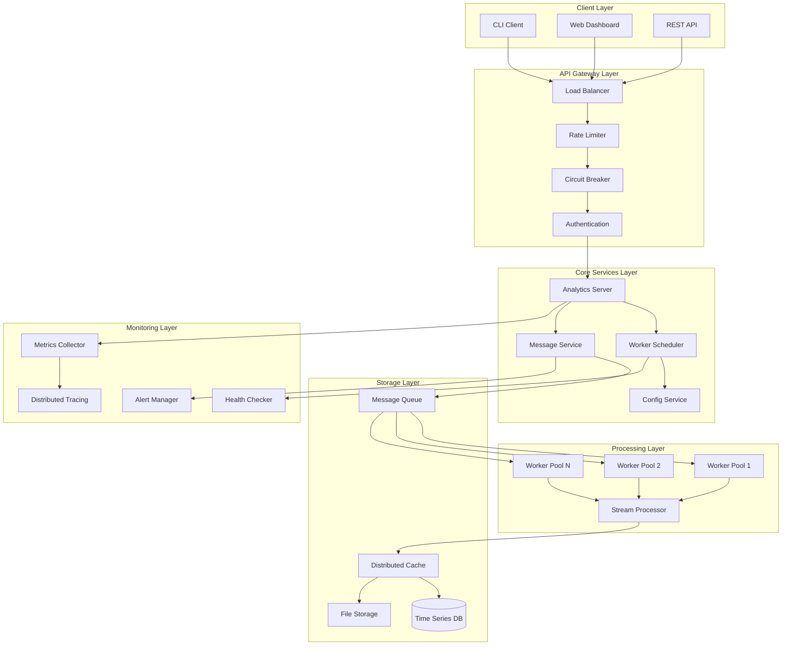
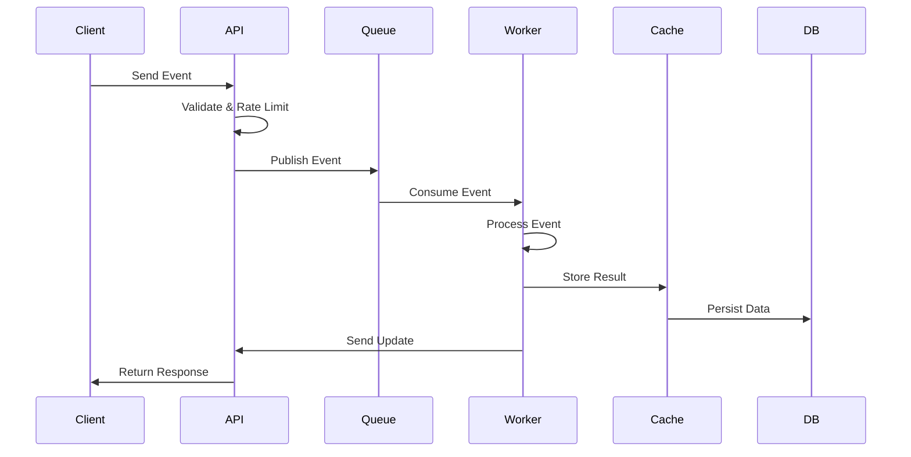
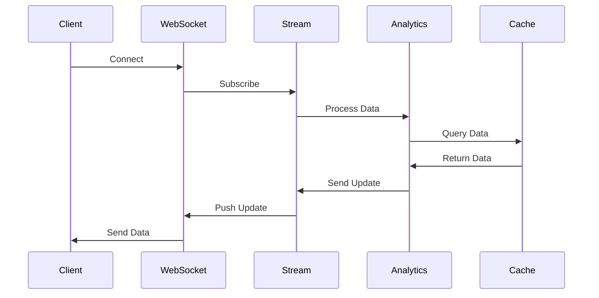

# 🏗️ Architecture Documentation

## Overview

The Distributed Real-Time Analytics Platform is designed as a microservices architecture that demonstrates advanced Go concurrency patterns. The system is built to handle massive scale while maintaining high performance and reliability.

## System Architecture

### High-Level Architecture

## Component Details

### 1. Client Layer

#### CLI Client
- **Purpose**: Command-line interface for system administration
- **Technology**: Cobra CLI framework
- **Features**:
  - Send test events
  - Monitor system health
  - View analytics data
  - Manage configurations

#### Web Dashboard
- **Purpose**: Real-time web interface for analytics
- **Technology**: WebSocket + HTML5
- **Features**:
  - Live data visualization
  - Real-time metrics
  - System monitoring
  - Alert management

#### REST API
- **Purpose**: Programmatic access to the platform
- **Technology**: Gin HTTP framework
- **Features**:
  - Event ingestion
  - Query analytics data
  - System management
  - Health checks

### 2. API Gateway Layer

#### Load Balancer
- **Purpose**: Distribute incoming requests across multiple server instances
- **Implementation**: Round-robin with health checks
- **Features**:
  - Health-based routing
  - Weighted distribution
  - Failover handling

#### Rate Limiter
- **Purpose**: Protect system from abuse and overload
- **Implementation**: Token bucket algorithm
- **Features**:
  - Per-client rate limiting
  - Burst handling
  - Dynamic rate adjustment

#### Circuit Breaker
- **Purpose**: Prevent cascade failures
- **Implementation**: Three-state circuit breaker
- **Features**:
  - Fast failure detection
  - Automatic recovery
  - Fallback mechanisms

### 3. Core Services Layer

#### Analytics Server
- **Purpose**: Main orchestrator and API server
- **Concurrency Patterns**:
  - Actor model for state management
  - Connection pooling for database access
  - Worker pools for request processing
- **Features**:
  - Event ingestion
  - Real-time query processing
  - WebSocket connections
  - Health monitoring

#### Worker Scheduler
- **Purpose**: Manage and schedule data processing tasks
- **Concurrency Patterns**:
  - Priority queues for task scheduling
  - Worker pools with dynamic scaling
  - Lock-free task distribution
- **Features**:
  - Task queuing and scheduling
  - Worker lifecycle management
  - Load balancing
  - Fault tolerance

#### Message Service
- **Purpose**: Handle inter-service communication
- **Concurrency Patterns**:
  - Publisher-subscriber pattern
  - Message batching
  - Backpressure handling
- **Features**:
  - Event streaming
  - Message routing
  - Delivery guarantees
  - Dead letter handling

### 4. Processing Layer

#### Worker Pools
- **Purpose**: Parallel data processing
- **Concurrency Patterns**:
  - Dynamic worker scaling
  - Work stealing
  - Lock-free work distribution
- **Features**:
  - MapReduce processing
  - Stream processing
  - Batch processing
  - Real-time analytics

#### Stream Processor
- **Purpose**: Real-time data stream processing
- **Concurrency Patterns**:
  - Reactive programming
  - Backpressure handling
  - Windowing operations
- **Features**:
  - Continuous data processing
  - Real-time aggregations
  - Event filtering
  - Time-based windows

### 5. Storage Layer

#### Distributed Cache
- **Purpose**: High-speed data access
- **Technology**: Redis cluster
- **Concurrency Patterns**:
  - Connection pooling
  - Lock-free caching
  - Cache invalidation
- **Features**:
  - Multi-level caching
  - TTL management
  - Cache warming
  - Distributed invalidation

#### Time Series Database
- **Purpose**: Store and query time-series data
- **Technology**: InfluxDB
- **Features**:
  - High-performance writes
  - Efficient time-based queries
  - Data compression
  - Retention policies

#### File Storage
- **Purpose**: Store large data files
- **Technology**: Local filesystem with future S3 support
- **Features**:
  - Efficient file operations
  - Compression
  - Backup and recovery

### 6. Monitoring Layer

#### Metrics Collector
- **Purpose**: Collect and aggregate system metrics
- **Concurrency Patterns**:
  - Lock-free metric collection
  - Batch processing
  - Asynchronous reporting
- **Features**:
  - Custom metrics
  - Performance counters
  - Resource utilization
  - Business metrics

#### Health Checker
- **Purpose**: Monitor system health
- **Features**:
  - Service health checks
  - Dependency monitoring
  - Automated recovery
  - Health reporting

#### Alert Manager
- **Purpose**: Handle alerts and notifications
- **Features**:
  - Alert rules
  - Notification channels
  - Alert aggregation
  - Escalation policies

## Data Flow

### Event Processing Flow

### Real-Time Analytics Flow

## Concurrency Patterns Used

### 1. Actor Model
- **Location**: `pkg/concurrency/actor/`
- **Use Case**: Service state management
- **Benefits**: Isolated state, fault tolerance, message passing

### 2. Reactive Programming
- **Location**: `pkg/concurrency/reactive/`
- **Use Case**: Stream processing
- **Benefits**: Backpressure handling, composable operations

### 3. Circuit Breaker
- **Location**: `pkg/concurrency/circuitbreaker/`
- **Use Case**: Fault tolerance
- **Benefits**: Fast failure, automatic recovery

### 4. Worker Pool
- **Location**: `pkg/concurrency/workerpool/`
- **Use Case**: Parallel processing
- **Benefits**: Resource management, load balancing

### 5. Rate Limiting
- **Location**: `pkg/concurrency/ratelimit/`
- **Use Case**: Request throttling
- **Benefits**: System protection, fair resource usage

### 6. Connection Pooling
- **Location**: `pkg/concurrency/pool/`
- **Use Case**: Resource management
- **Benefits**: Performance, resource efficiency

### 7. Lock-Free Programming
- **Location**: `pkg/concurrency/lockfree/`
- **Use Case**: High-performance data structures
- **Benefits**: No blocking, high throughput

### 8. Event Sourcing
- **Location**: `pkg/concurrency/eventsourcing/`
- **Use Case**: Audit trail
- **Benefits**: Complete history, state reconstruction

### 9. CQRS
- **Location**: `pkg/concurrency/cqrs/`
- **Use Case**: Command/query separation
- **Benefits**: Scalability, optimization

### 10. Saga Pattern
- **Location**: `pkg/concurrency/saga/`
- **Use Case**: Distributed transactions
- **Benefits**: Consistency, fault tolerance

### 11. MapReduce
- **Location**: `pkg/concurrency/mapreduce/`
- **Use Case**: Distributed processing
- **Benefits**: Scalability, fault tolerance

## Scalability Considerations

### Horizontal Scaling
- **Stateless Services**: All services are stateless for easy scaling
- **Load Balancing**: Multiple instances behind load balancers
- **Data Partitioning**: Data is partitioned across multiple nodes
- **Service Discovery**: Dynamic service registration and discovery

### Vertical Scaling
- **Resource Optimization**: Efficient memory and CPU usage
- **Connection Pooling**: Reuse connections to reduce overhead
- **Caching**: Multi-level caching for performance
- **Async Processing**: Non-blocking operations where possible

### Performance Optimization
- **Lock-Free Programming**: Avoid locks for better performance
- **Object Pooling**: Reuse objects to reduce GC pressure
- **Batch Processing**: Process multiple items together
- **Compression**: Compress data to reduce network usage

## Security Considerations

### Authentication & Authorization
- **JWT Tokens**: Stateless authentication
- **Role-Based Access**: Fine-grained permissions
- **API Keys**: Service-to-service authentication

### Data Protection
- **Encryption**: Data encrypted in transit and at rest
- **Input Validation**: All inputs are validated
- **Rate Limiting**: Protection against abuse

### Network Security
- **TLS**: All communications encrypted
- **Firewall Rules**: Network access control
- **VPN**: Secure remote access

## Monitoring & Observability

### Metrics
- **Application Metrics**: Custom business metrics
- **System Metrics**: CPU, memory, disk usage
- **Performance Metrics**: Latency, throughput, error rates

### Logging
- **Structured Logging**: JSON-formatted logs
- **Log Levels**: Debug, info, warn, error
- **Log Aggregation**: Centralized log collection

### Tracing
- **Distributed Tracing**: Track requests across services
- **Performance Profiling**: Identify bottlenecks
- **Dependency Mapping**: Service dependency visualization

### Alerting
- **Threshold Alerts**: Alert on metric thresholds
- **Anomaly Detection**: Detect unusual patterns
- **Escalation**: Automatic alert escalation

## Deployment Architecture

### Containerization
- **Docker**: All services containerized
- **Multi-stage Builds**: Optimized image sizes
- **Health Checks**: Container health monitoring

### Orchestration
- **Kubernetes**: Container orchestration
- **Helm Charts**: Package management
- **Service Mesh**: Inter-service communication

### CI/CD
- **GitHub Actions**: Automated testing and deployment
- **Staging Environment**: Pre-production testing
- **Blue-Green Deployment**: Zero-downtime deployments

## Future Enhancements

### Planned Features
- **Machine Learning**: ML-based analytics
- **GraphQL API**: More flexible querying
- **Multi-tenancy**: Support for multiple organizations
- **Advanced Visualization**: More chart types and dashboards

### Scalability Improvements
- **Auto-scaling**: Automatic resource scaling
- **Edge Computing**: Deploy closer to users
- **Caching Layers**: Additional caching tiers
- **Database Sharding**: Horizontal database scaling

---

*This architecture demonstrates GOD-LEVEL Go concurrency skills through a production-grade distributed system.*
